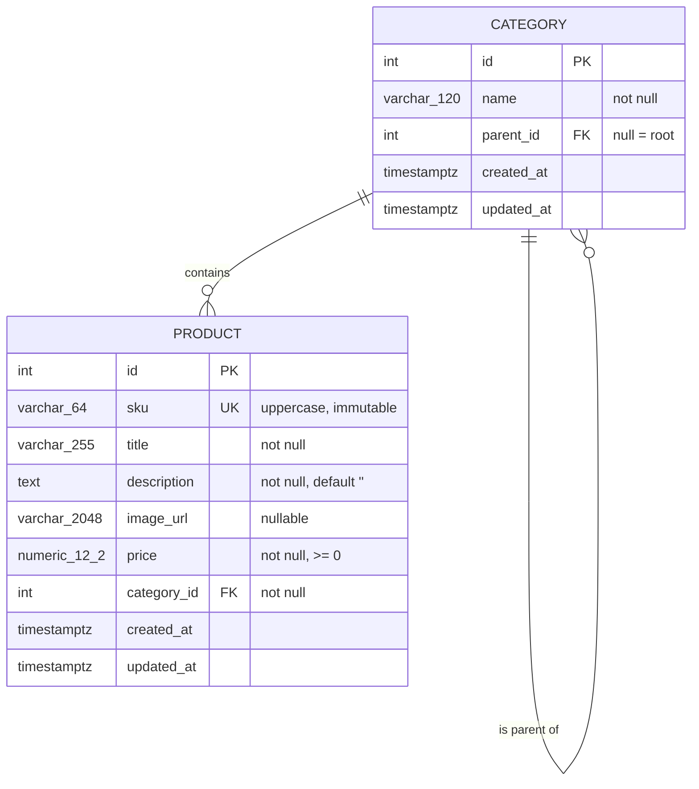

# Product Service — Design

A REST microservice owning the product catalogue of an e-commerce system: products, a hierarchical category tree, and a filterable search over products. It is the system of record for catalogue data and exposes nothing else — no orders, no inventory, no auth. Built with FastAPI, SQLAlchemy 2.0 async, Alembic and PostgreSQL 16.

## 1. Scope

### Requirements covered

| Requirement | Where it lands |
|---|---|
| Product model with `title` | `products.title` |
| Product model with `description` | `products.description` |
| Product model with `image` | `products.image_url` (see D6) |
| Product model with unique SKU | `products.sku` + `uq_products_sku` (D4) |
| Product model with `price` | `products.price` `NUMERIC(12,2)` (D5) |
| Product linked to a category | `products.category_id` FK (D3) |
| Category model with `name` | `categories.name` |
| Category linked to a parent category | `categories.parent_id` self-FK (D1) |
| CRUD for products | §4.2 |
| CRUD for categories | §4.1 |
| Search matching name **or** SKU | `q` and `sku` parameters (D9) |
| Search within a price range | `price_min` / `price_max` (D9) |
| Search under a certain category | `category_id` + `include_descendants` (D9) |
| Additional filters | `sort`, `limit`, `offset`, and subtree control |
| Unit tests for search | §5, and the test plan in phase 4 |
| Running project at presentation | Docker Compose + documented start command |

### Non-goals

Each of these is excluded deliberately, not overlooked.

| Excluded | Reason |
|---|---|
| Authentication and authorization | No identity model in scope; belongs at the gateway |
| Image upload and object storage | The requirement says "image", and a URL satisfies it without dragging in S3 and presigned URLs |
| Multi-currency pricing | One implicit currency keeps `price` a single scalar (D5) |
| Inventory, stock levels, orders, cart | Different bounded contexts |
| Product variants and options | Would double the model; a real catalogue needs it, this assignment does not |
| Soft delete and audit history | Considered and rejected (D14) |
| Relevance ranking and stemming in search | `ILIKE` substring matching is what the requirement asks for (D10) |
| Caching layer | Premature at this data size |
| Bulk import and CSV endpoints | Not requested |
| Rate limiting | Gateway concern |

## 2. Domain model



**Category** is a node in a single tree of arbitrary depth. `parent_id IS NULL` marks a root; several roots are allowed. Names are not globally unique — "Accessories" can legitimately exist under both Phones and Laptops — but they are unique among siblings.

**Product** belongs to exactly one category, which may be at any depth. A product is not required to sit on a leaf.

## 3. Database schema

### `categories`

| Column | Type | Null | Notes |
|---|---|---|---|
| `id` | `integer` | no | identity primary key |
| `name` | `varchar(120)` | no | trimmed on write |
| `parent_id` | `integer` | yes | FK → `categories.id`, `ON DELETE RESTRICT` |
| `created_at` | `timestamptz` | no | `server_default now()` |
| `updated_at` | `timestamptz` | no | `server_default now()`, bumped on update |

Constraints:

- `ck_categories_no_self_parent`: `CHECK (parent_id IS NULL OR parent_id <> id)` — catches the trivial cycle in the database, where it cannot be bypassed.
- `uq_categories_parent_name`: `UNIQUE (parent_id, name)` — no two siblings share a name. Note that Postgres treats `NULL` parents as distinct, so this does not constrain root names; accepted, since duplicate root names are a data-quality issue rather than a correctness one.

### `products`

| Column | Type | Null | Notes |
|---|---|---|---|
| `id` | `integer` | no | identity primary key |
| `sku` | `varchar(64)` | no | stored uppercase |
| `title` | `varchar(255)` | no | trimmed on write |
| `description` | `text` | no | defaults to empty string, never `NULL` |
| `image_url` | `varchar(2048)` | yes | `http`/`https` URL |
| `price` | `numeric(12,2)` | no | `CHECK (price >= 0)` |
| `category_id` | `integer` | no | FK → `categories.id`, `ON DELETE RESTRICT` |
| `created_at` | `timestamptz` | no | |
| `updated_at` | `timestamptz` | no | |

`description` is `NOT NULL DEFAULT ''` rather than nullable: two representations of "no description" would mean every reader handles both.

### Indexes

| Index | Type | Query it serves |
|---|---|---|
| `categories_pkey` | btree unique | id lookup, FK checks |
| `ix_categories_parent_id` | btree | children lookup; each descent step of the subtree CTE |
| `products_pkey` | btree unique | id lookup |
| `uq_products_sku` | btree unique | SKU uniqueness, and the `?sku=` exact filter |
| `ix_products_category_id` | btree | `?category_id=` filter, and the RESTRICT check on category delete |
| `ix_products_price` | btree | `?price_min=`/`?price_max=` range, and `sort=price` |
| `ix_products_created_at_id` | btree `(created_at DESC, id DESC)` | the default sort, first page without a sort |
| `ix_products_title_trgm` | GIN `gin_trgm_ops` | `?q=` substring match against `title` (D10) |

`description` is deliberately left unindexed. A GIN trigram index on a long text column is expensive to maintain on every write, and description matches are a secondary convenience behind title matches. The planner will bitmap-OR the title index with a scan for the description leg, which is acceptable at the expected catalogue size. The scale-up path is one generated `tsvector` column covering both fields with a single GIN index, replacing the trigram index.

## 4. API contract

Everything is under `/api/v1`. All responses are JSON. `GET /health` sits outside the version prefix and returns `{"status": "ok"}` plus database reachability.

### 4.1 Categories

| Method | Path | Purpose | Request | Success | Errors |
|---|---|---|---|---|---|
| `POST` | `/categories` | Create | `{name, parent_id?}` | `201` + category | `422` unknown parent, `409` duplicate sibling name |
| `GET` | `/categories` | List | `?parent_id=&limit=&offset=` | `200` + page | `422` bad params |
| `GET` | `/categories/{id}` | Read one | – | `200` + category | `404` |
| `PATCH` | `/categories/{id}` | Partial update | `{name?, parent_id?}` | `200` + category | `404`, `409` cycle or duplicate name, `422` unknown parent |
| `DELETE` | `/categories/{id}` | Delete | – | `204` | `404`, `409` has children or products |

### 4.2 Products

| Method | Path | Purpose | Request | Success | Errors |
|---|---|---|---|---|---|
| `POST` | `/products` | Create | product body | `201` + product | `409` duplicate SKU, `422` unknown category or invalid field |
| `GET` | `/products` | **List and search** | see §4.3 | `200` + page | `422` bad params |
| `GET` | `/products/{id}` | Read by id | – | `200` + product | `404` |
| `GET` | `/products/by-sku/{sku}` | Read by SKU | – | `200` + product | `404` |
| `PATCH` | `/products/{id}` | Partial update | any field except `sku` | `200` + product | `404`, `422` attempted SKU change or unknown category |
| `DELETE` | `/products/{id}` | Delete | – | `204` | `404` |

`by-sku` exists because SKU is the natural key an external system holds — without it every integrator has to search and unwrap a single-element page.

### 4.3 The search endpoint

`GET /api/v1/products`. Every parameter is optional; with none supplied it is a plain paginated listing. **Supplied filters combine with AND.** An unknown parameter name is a `422`, not a silently ignored filter.

| Parameter | Type | Default | Validation | Semantics |
|---|---|---|---|---|
| `q` | string | – | 1–200 chars | Case-insensitive **substring** match against `title` OR `description`. A literal `%` or `_` in the term is escaped and matches itself. |
| `sku` | string | – | ≤ 64 chars | Exact match after uppercasing the input. Coexists with `q` and ANDs with it. |
| `category_id` | int | – | > 0 | Restricts to that category. An id that does not exist yields an empty page, not a `404` — a filter matching nothing is not a missing resource. |
| `include_descendants` | bool | `true` | – | When true, `category_id` also matches every category beneath it, at any depth. Only meaningful alongside `category_id`. |
| `price_min` | decimal | – | ≥ 0, 2 dp | **Inclusive** lower bound. |
| `price_max` | decimal | – | ≥ 0, 2 dp | **Inclusive** upper bound. `price_min > price_max` is a `422`, not an empty page — it is a client bug worth surfacing. |
| `sort` | enum | `-created_at` | `price`, `-price`, `title`, `-title`, `created_at`, `-created_at` | `-` prefix means descending. Always followed by an `id ASC` tiebreaker so equal values cannot shuffle between pages. |
| `limit` | int | `20` | 1–100 | Page size. Above the maximum is a `422` rather than a silent clamp. |
| `offset` | int | `0` | ≥ 0 | Rows skipped. |

Response envelope, shared by every list endpoint:

```json
{
  "items": [ { "id": 12, "sku": "SMART-1", "title": "Smart Phone X", "description": "...",
               "image_url": "https://cdn.example.com/smart-1.jpg", "price": "799.00",
               "category_id": 3, "created_at": "...", "updated_at": "..." } ],
  "total": 4,
  "limit": 20,
  "offset": 0
}
```

`total` is the count of all matches, not the size of the returned page. `price` serializes as a JSON **string** to survive the round trip through clients whose JSON numbers are IEEE doubles.

### Example requests

```bash
# Products whose title or description contains "phone", cheapest first
curl 'localhost:8000/api/v1/products?q=phone&sort=price'

# Everything under Electronics, including every nested subcategory
curl 'localhost:8000/api/v1/products?category_id=1'

# Directly in Phones only, ignoring Smartphones beneath it
curl 'localhost:8000/api/v1/products?category_id=2&include_descendants=false'

# Mid-range products under Electronics matching "phone" — filters AND together
curl 'localhost:8000/api/v1/products?q=phone&category_id=1&price_min=100&price_max=500'

# Exact SKU lookup through search, and the direct natural-key route
curl 'localhost:8000/api/v1/products?sku=smart-1'
curl 'localhost:8000/api/v1/products/by-sku/SMART-1'
```

### 4.4 Error format

One shape for every error the service produces, including FastAPI's own validation failures, which are re-wrapped by a `RequestValidationError` handler so clients never see two different schemas:

```json
{ "error": { "code": "duplicate_sku",
             "message": "A product with SKU 'SMART-1' already exists.",
             "details": [] } }
```

| Code | Status | Raised when |
|---|---|---|
| `not_found` | 404 | id or SKU does not exist |
| `duplicate_sku` | 409 | SKU already taken |
| `duplicate_category_name` | 409 | sibling with the same name |
| `category_cycle` | 409 | re-parenting would make a category its own ancestor |
| `category_not_empty` | 409 | delete blocked by child categories or products |
| `validation_error` | 422 | bad body or query parameter; offending fields in `details` |

## 5. Architecture

```
app/api/v1/      HTTP only: bind and validate input, call one collaborator, serialize
app/services/    rules spanning more than one repository (cycle check, delete guards)
app/repositories/ query construction and execution
app/models/      SQLAlchemy ORM
app/schemas/     Pydantic request and response models
app/errors.py    domain exceptions; only main.py maps them to status codes
```

Dependencies point strictly downward. Repositories never import from `app.api` and never raise `HTTPException`, so the business layer stays callable from a CLI, a worker or a test without a request in flight.

**The search query builder is a pure function.** `build_search_query(ProductFilters) -> Select` takes a frozen filter dataclass and returns a SQLAlchemy `Select`, touching no session and performing no I/O. This is the single most important structural decision in the document, because `requirements.md` asks for unit tests on search specifically: as a pure function, its semantics can be asserted against compiled SQL with no database, while endpoint tests separately prove the filters return the right rows from real Postgres. A `build_count_query` sharing the same `_apply_filters` helper guarantees `total` and `items` can never disagree about what matched.

The subtree filter compiles to a recursive CTE over `categories`, which is why integration tests must run on Postgres rather than SQLite.

## 6. Decisions

**D1 — Category tree as an adjacency list.** `parent_id` self-FK, `NULL` at the root. Writes are a single row change and it mirrors the requirement's wording ("parent - link to category model"). Subtree reads cost a recursive CTE. *Rejected:* a materialized path column, which makes subtree reads a prefix scan but turns any re-parent into a bulk rewrite of the whole branch; and a closure table, which makes both fast but adds a second table and triggers to keep it honest. *Would switch if* the tree grew deep and re-parenting stayed rare — then a materialized path wins.

**D2 — Cycle prevention in the service layer, plus a database guard.** `CHECK (parent_id <> id)` blocks self-parenting in the database. The general case — making a category a child of its own descendant — is checked in the service by walking the proposed ancestor chain before the update, returning `409 category_cycle`. *Rejected:* a recursive trigger, which is correct but hides business logic in the schema and is awkward to test; and trusting clients, which corrupts the tree permanently and makes the subtree CTE loop.

**D3 — `RESTRICT` on category delete.** Deleting a category with children or products returns `409 category_not_empty` naming the blocker; the client must re-parent or reassign first. *Rejected:* cascade, which would silently destroy products — the worst possible outcome for a catalogue of record; and re-parenting children to the grandparent automatically, which is convenient but makes a destructive operation do two things at once without being asked.

**D4 — SKU uppercased on write, immutable after creation.** Normalizing on write means the unique index enforces uniqueness for real; storing as given and comparing case-insensitively would let `smart-1` and `SMART-1` coexist as separate products, which is exactly the bug a unique SKU is meant to prevent. Format `^[A-Z0-9][A-Z0-9._-]{2,63}$`. `PATCH` rejects a `sku` change with `422`, because external systems key off it and rewriting it silently breaks them. *Rejected:* a case-insensitive citext column, which works but adds an extension for one field; mutable SKUs, which need a redirect or alias table to be safe.

**D5 — `NUMERIC(12,2)` and one implicit currency.** Binary floating point cannot represent `0.10` exactly and prices must not drift. Twelve digits with two decimals covers any realistic price. **Assumption: the whole catalogue is priced in a single currency, which the service does not name or store.** Zero is allowed (free items and promotions are real); negative is rejected by a `CHECK`. *Rejected:* integer minor units, which avoid decimals entirely but push scaling into every client; a `currency` column, which is not multi-currency support unless rounding rules and per-currency scale come with it, so it would be a half-measure.

**D6 — Image as a URL.** `image_url`, nullable, `http`/`https` validated. *Rejected:* upload endpoints with object storage, which bring presigned URLs, content-type sniffing, size limits and a storage dependency — real work that the word "image" in the requirement does not ask for. Listed as a non-goal so its absence reads as a decision.

**D7 — Integer identity primary keys.** Smaller indexes, readable URLs, trivial to demo. Sequential ids do leak catalogue size and are enumerable, which for a public product catalogue is not sensitive — products are meant to be discoverable. *Rejected:* UUIDv7, which removes enumeration and lets clients generate ids offline, at the cost of index size and unreadable demo URLs. *Would switch if* the ids were exposed for a resource where enumeration matters, or rows were created across multiple writers.

**D8 — Filters live on the collection resource.** `GET /api/v1/products` with query parameters, not `POST /products/search` or `GET /products/search`. A search with no filters is exactly a list, so a separate endpoint would duplicate pagination, sorting and serialization and force clients to choose between two near-identical routes. Filters as query parameters also stay cacheable and linkable. *Rejected:* a `POST` search taking a JSON filter body, which is the right call once filters become nested boolean expressions too long for a URL — not the case here.

**D9 — Search semantics as specified in §4.3.** The choices worth defending: `q` covers title *and* description because a client searching "waterproof" expects to find it wherever it is written; filters AND rather than OR because narrowing is the intent of adding a filter; price bounds are inclusive because `price_max=500` colloquially means "up to 500"; an inverted range is a `422` because it can only be a client bug; an unknown `category_id` is an empty page because the filter, not a resource, is what was requested.

**D10 — `ILIKE` substring matching with a `pg_trgm` GIN index on `title`.** The requirement asks for products "matching a certain name", which is substring matching, not relevance ranking. `ILIKE '%term%'` cannot use a btree index at all, so without trigrams every search is a sequential scan; the GIN index makes the title leg indexed for terms of three characters or more (shorter terms fall back to a scan, which is acceptable). *Rejected:* unindexed `ILIKE`, which is fine at a thousand rows and quietly awful at a million; and a `tsvector` full-text column, which brings stemming and ranking but changes the semantics — full-text search would not match "phon" inside "phone", and matching partial words is the behaviour asked for. *Would switch to* `tsvector` if relevance ordering or multi-language stemming became a requirement.

**D11 — Limit/offset pagination with a total count.** Easy to demo, lets a client jump to a page, and `total` is what a UI needs to render a pager. Deep offsets degrade because Postgres must walk and discard the skipped rows. *Rejected:* keyset pagination, which stays fast at any depth but cannot express "page 7" and complicates the API for a catalogue that will never be paged that deeply. *Would switch if* the catalogue grew past the point where `OFFSET` cost showed up. The `id` tiebreaker on every sort is what makes such a migration possible later, and prevents rows appearing twice or not at all across pages today.

**D12 — `PATCH` only for updates, no `PUT`.** Clients want to change a price without resending the description. Offering both doubles the validation surface and invites the classic bug where `PUT` blanks omitted fields. *Rejected:* `PUT` full replacement, which is more RESTful in the strict sense and is what I would add alongside `PATCH` if an integrator needed idempotent full writes.

**D13 — One error envelope, including for validation errors.** FastAPI's default `422` body has its own `{"detail": [...]}` shape; a `RequestValidationError` handler re-wraps it so clients parse one schema everywhere. Machine-readable `code` alongside the human `message` so clients branch on the code rather than string-matching.

**D14 — Hard delete, no optimistic locking.** `DELETE` removes the row. Soft deletion was considered — it preserves history and makes deletes reversible — but it infects every query with a `WHERE deleted_at IS NULL` that is easy to forget, and the requirement asks for CRUD, not an audit trail. Concurrent updates are last-write-wins; a version column with `409` on conflict is the answer if concurrent editing of one product ever becomes real. Both are recorded here so their absence is visibly a choice.

## 7. Open questions

Defaults are chosen so implementation is not blocked. Confirm or override:

1. **`q` matches title *and* description** (D9). If search should be title-only, the description leg and its performance note disappear.
2. **`category_id` includes descendants by default** (`include_descendants=true`). Defaulting to `false` would be more literal but makes "everything under Electronics" — the requirement's own phrasing — the non-default path.
3. **Single implicit currency** (D5). If the catalogue is multi-currency, that changes the model materially and should be settled now rather than retrofitted.
4. **Sequential integer ids exposed in URLs** (D7). Fine for a public catalogue; say so if UUIDs are preferred.
5. **`PATCH` only, no `PUT`** (D12). Adding `PUT` is cheap if reviewers expect it.
